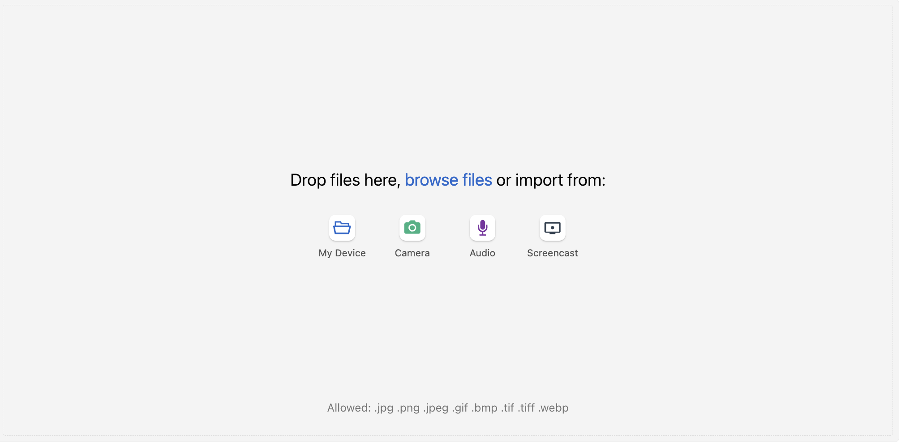

# Uploader Plugin for WinterCMS

<p align="center">
  
</p>

A comprehensive file upload management system for WinterCMS that empowers administrators to create backend-managed upload forms with fine-grained access control and frontend components for seamless user file submission.

---

## 📋 Table of Contents

- [Quick Start](#quick-start)
- [Installation](#installation)
- [How It Works](#how-it-works)
- [Backend Setup](#backend-setup)
- [Frontend Integration](#frontend-integration)
  - [Using the Uploader Component](#using-the-uploader-component)
  - [Using Pre-built Blocks](#using-pre-built-blocks)
- [Advanced Usage](#advanced-usage)
- [Helper Functions](#helper-functions)
- [Examples](#examples)
- [Limitations & Notes](#limitations--notes)
- [License](#license)

---

## Quick Start

1. **Install** via Composer:
   ```bash
   composer require mercator/wn-uploader-plugin
   ```

2. **Migrate** the database:
   ```bash
   php artisan winter:up
   ```

3. **Create an Upload Form** in the WinterCMS backend:
   - Go to **Uploaders** in the backend menu
   - Fill in the form details (title, description, allowed file types, etc.)
   - If needed, add authorized users on the **Users** tab (each gets an auto-generated token)
   - Save and copy the **Form ID**

4. **Add to Frontend** using the component (for blocks, see [Using Pre-built Blocks](#using-pre-built-blocks)):
   ```twig
   [uploader]
   formId = "YOUR_FORM_ID"
   
   
   ```

---

## Installation

### Prerequisites

- WinterCMS 1.2.8+
- PHP 8.3+

### Steps

```bash
composer require mercator/wn-uploader-plugin
php artisan winter:up
```

The plugin will automatically register and create the necessary database tables.

---

## How It Works

The Uploader Plugin follows a **backend-defined, frontend-referenced** architecture:

```
┌─────────────────────────────────────────────────────────────┐
│ Backend (Administrator)                                     │
├─────────────────────────────────────────────────────────────┤
│ • Create Upload Forms                                       │
│ • Add authorized users (auto-generated tokens)              │
│ • Set file constraints (type, size)                         │
│ • Send invite emails                                        │
│ • Get Form ID                                               │
└─────────────────────────────────────────────────────────────┘
                            ↓
┌─────────────────────────────────────────────────────────────┐
│ Frontend (Visitors/Users)                                   │
├─────────────────────────────────────────────────────────────┤
│ • Reference Form ID in page/block/component                 │
│ • Optionally provide a user token for access validation     │
│ • Upload files (validated server-side)                      │
│ • Files stored in media folder                              │
└─────────────────────────────────────────────────────────────┘
```

**Key Principle:** All upload logic is defined in the backend. No upload form can function without a matching backend definition.

---

## Backend Setup

### Creating Upload Forms

1. Navigate to **Uploaders** in the WinterCMS backend menu
2. Click **+ New Form**
3. Fill in the following details:

#### Form Configuration

| Field | Type | Description |
|-------|------|-------------|
| **Title** | Text | Display name for the form (shown above the uploader/gallery/slideshow when enabled). |
| **Form ID** | Text | Read-only, auto-generated identifier used to reference this form on the frontend. |
| **Description** | Textarea | Optional description displayed alongside the title. |
| **Upload Directory** | Media Finder | The media-library folder uploaded files are stored in. |
| **Timezone** | Dropdown | Timezone used to interpret Start/End Date below (default: `Europe/Zurich`). |
| **Start / End Date and Time** | Datetime | The window during which the upload interface is open. Outside this window, uploads are refused (see `uploaderUploaderOpen` below). |
| **Auto-upload files immediately** | Switch | If enabled, files upload as soon as they're dropped, skipping the Uppy editor step. |

Additional settings are grouped into tabs:

| Tab | Field | Description |
|-----|-------|--------------|
| **Pre-Processing** | Enable Uppy Image Editor | Lets users crop/rotate before upload (disabled automatically if auto-upload is on). |
| | Preserve EXIF Metadata | Keep EXIF data on uploaded images instead of stripping it. |
| | Enable client-side resizing and compression | Resize/compress images in the browser before upload. |
| | Allowed File Types | Comma-separated extensions (default: `jpg,png,jpeg,gif,bmp,tif,tiff,heif,heic,webp,mp4,mov,webm`). |
| **Resizing & Compression** | Max width / height (px) | Only shown when client-side resizing is enabled. |
| | JPEG/WebP Quality (0.0–1.0) | Compression quality when resizing is enabled. |
| **Restrictions** | Restrict access to specific users | When enabled, only users added on the **Users** tab (via their token, passed as `?user=<token>`) may open or upload to this form. |
| | Maximum File Size (MB) | Per-file limit. `0` or empty = unlimited. |
| | Maximum Total Upload Size (MB) | Limit across all of a user's uploads to this form. `0` or empty = unlimited. |
| **Users** | Users | A relation manager for adding authorized users (Name, Email, Active). Each user is issued a random **token** automatically — this token is the value that must be passed as `?user=` on the frontend, not the email or name. |
| **Categories** | Categories | Optional sub-galleries (e.g. "Morning", "Lunch", "Church"). If any exist, uploaders are prompted to tag their file with one, and the gallery/slideshow blocks can filter by them. |
| **QR Card** | Card Style + preview | Pick a printable QR card design (Classic/Framed/Elegant/Poster) linking straight to this form's upload page, with a Print button. |

#### Authorized Users & Invitations

When **Restrict access to specific users** is enabled, add users on the **Users** tab. Each user gets an auto-generated **token** — this is what's checked against the `user` parameter on the frontend (URL query string, route segment, or a component/block's user field), not their name or email.

To notify a user by email, select them in the Users grid and click **Send Invites**. This sends each selected user (who has an email set) a message containing a personal upload link in the form `/mercator/uploader/default/{form_id}/{their_token}` — there's no separate configurable subject/body template.

---

## Frontend Integration

### Using the Uploader Component

The `Uploader` component renders an interactive upload form on any CMS page.

#### Component Snippet

Add this to your CMS page or layout:

```ini
[uploader]
formId = "your_form_id_here"
userId = "optional_user_id_here"
```

#### Component Properties

| Property | Type | Required | Description |
|----------|------|----------|-------------|
| `formId` | String | Yes | The **Form ID** from the backend upload form definition. |
| `userId` | String | No | Optional user token (from the form's Users tab). Required only if the form is restricted. |

#### Page Markup

In your page template, render the component:

```twig
<section class="upload-container">
    <h2>Upload Your Files</h2>
    
</section>
```

#### Component Output

The component renders:
- **Form title and description** (from backend)
- **File input field** with drag-and-drop support
- **Upload progress indicator**
- **Success/error messages**
- **Access denial message** if user is not authorized

**Access Denied Message:**
```
Upload form not found or user not authorized.
```

> **Note:** `userId` here must be a **token** from the form's Users tab (see [Backend Setup](#backend-setup)), not a WinterCMS site-user ID or email. If the form isn't restricted, leave `userId` empty.

---

### Using Pre-built Blocks

This plugin depends on and registers with **[Winter.Blocks](https://github.com/wintercms/wn-blocks-plugin)** (`winter/wn-blocks-plugin`, installed automatically via Composer). Blocks are **not** CMS components — they are managed through Winter.Blocks' own block editor and rendered with its Twig functions, `renderBlocks()` / `renderBlock()`, not ``.

> ⚠️ **Currently active blocks:** only `upload.block` (UIKit), `qrcode.block` (UIKit), `gallery.block`, and `slideshow.block` are registered. The Bootstrap variants (`upload_bootstrap.block`, `qrcode_bootstrap.block`) exist as files but are commented out in `registerBlocks()` in [`Plugin.php`](Plugin.php) — uncomment those two lines if you need Bootstrap-styled blocks.
>
> ⚠️ Per the plugin's own description in `Plugin.php`: **you can only have one uploader block per page** for the time being.

#### Available Blocks

| Block file | Registered code | Purpose |
|------------|------------------|---------|
| `upload.block` | `mercator_uploader_uploader` | Upload form (UIKit), with optional sub-category prompt |
| `qrcode.block` | `mercator_uploader_qrcode` | QR code linking to an upload/gallery/slideshow page |
| `gallery.block` | `mercator_uploader_gallery` | Filterable gallery of a form's uploaded files |
| `slideshow.block` | `mercator_uploader_slideshow` | Fullscreen, auto-refreshing slideshow (for live event displays) |

#### The simplest way: render a block directly in a page or layout

You don't need to build a `blocks`-type field to use a block — you can call `renderBlock()` with the registered code and its field values directly in a CMS page's or layout's Twig markup:

```twig
{{ renderBlock('mercator_uploader_gallery', {
    form_id: 'photo_contest_2024',
    restrict_categories: []
}) }}
```

#### The full way: an editable `blocks` field

If you want editors to add/arrange/reconfigure blocks visually in the backend:

1. Add a `blocks`-type field to your page or layout, e.g. via a Winter.Pages layout:
   ```twig
   {variable type="blocks" name="blocks" tags="pages" tab="winter.pages::lang.editor.content"}{/variable}
   ```
2. In the page editor, open the **Blocks** widget and add e.g. "Uppy - File Uploader" or "Uppy - Gallery" from the palette, filling in the fields shown per block below.
3. Render the collected blocks in your layout:
   ```twig
   {{ renderBlocks(blocks) }}
   ```

#### Block Fields

##### `upload.block`

| Field (YAML key) | Type | Description |
|-------------------|------|-------------|
| `form_id` | Dropdown | The form this uploader submits to. Overridden by a `?id=FORM_ID` URL parameter if present. |
| `text_position` | Dropdown | `none`, `above`, or `below` — where to render the form's title/description relative to the uploader. |
| `restrict_categories` | Checkbox list | Which of the form's sub-categories to offer when uploading. Defaults to `["all"]` (every category). If this resolves to exactly one category, the picker is skipped. |
| `category_prompt_text` | Text | The question shown above the sub-category picker (default: "Where was this taken?"). |

##### `qrcode.block`

| Field (YAML key) | Type | Description |
|-------------------|------|-------------|
| `form_id` | Dropdown | The form to generate a QR code for. Overridden by `?id=FORM_ID`. |
| `url` | Text | Relative URL of the page the code should link to (default: `/mercator/uploader/default`, the plugin's built-in upload page). |
| `text_position` | Dropdown | `none`, `above`, or `below` — position of the form's title/description. |

##### `gallery.block` / `slideshow.block`

Both share the same two fields:

| Field (YAML key) | Type | Description |
|-------------------|------|-------------|
| `form_id` | Dropdown | The form whose uploaded files to display. Overridden by `?id=FORM_ID`. |
| `restrict_categories` | Checkbox list | Which sub-galleries to show. Defaults to `["all"]` (every category); files with no category only show when "All" is checked. |

> None of the blocks have a `user_id`/`userId` field. For a **restricted** form, pass the viewer's token as a `?user=TOKEN` query parameter on the page URL — omitted, it defaults to the literal string `NONE`, which never matches a real token.

#### QR Code Example

```twig
{{ renderBlock('mercator_uploader_qrcode', {
    form_id: 'survey_2024',
    url: '/file-submission',
    text_position: 'above'
}) }}
```

Scanning the generated code opens `/file-submission?id=survey_2024`.

---

#### Gallery Example

```twig
{# All files #}
{{ renderBlock('mercator_uploader_gallery', { form_id: 'photo_contest_2024', restrict_categories: [] }) }}

{# Only specific sub-galleries #}
{{ renderBlock('mercator_uploader_gallery', { form_id: 'photo_contest_2024', restrict_categories: ['landscape', 'portrait'] }) }}
```

**Dynamic form via URL:** visiting the gallery page as `?id=photo_contest_2024` overrides whichever `form_id` was set on the block.

---

#### Slideshow Example — Live Event Display

1. Create an upload form in the backend (e.g. `event_photos`).
2. Create a CMS page (e.g. `/event-display`) rendering the slideshow block, using a minimal/fullscreen layout.
3. Point an event display screen at that page.
4. Visitors upload via a separate page rendering `upload.block` for the same form.
5. New uploads appear in the slideshow automatically (it polls the feed — see `uploaderSlideshowFeedUrl` under [Helper Functions](#helper-functions)).

```yaml
title = "Live Event Display"
url = "/event-display"
layout = "bare"
==
{{ renderBlock('mercator_uploader_slideshow', { form_id: 'event_photos', restrict_categories: [] }) }}
```

Use a minimal/fullscreen layout to maximize the display area.

---

## Advanced Usage

### Dynamic Form ID

The `Uploader` component doesn't read `?id=` from the URL automatically the way blocks do, but you can wire that up yourself using the `input()` Twig helper:

```twig
[uploader]
formId = "{{ input('id') }}"


```

URL: `https://example.com/upload?id=your_form_id`

### Passing a User Token from the URL

For a restricted form, the viewer's token typically arrives as a URL query parameter (e.g. from an invite email link) rather than being known in advance:

```twig
[uploader]
formId = "restricted_form"
userId = "{{ input('user') }}"


```

URL: `https://example.com/upload?user=THEIR_TOKEN` — the token comes from the form's Users tab, not from a WinterCMS site-user account.

### Custom Styling

Override default styles by adding CSS in your layout:

```css
.uploader-form {
    max-width: 600px;
    margin: 0 auto;
}

.uploader-input {
    border: 2px dashed #007bff;
    padding: 20px;
}

.uploader-success {
    background-color: #d4edda;
    color: #155724;
    padding: 12px;
    border-radius: 4px;
}
```

---

## Helper Functions

Use these helper functions in your Twig templates or PHP code:

### `uploaderForm(form_id)`

Retrieve an upload form object by its Form ID.

```twig


    <h3>{{ form.title }}</h3>
    <p>{{ form.description }}</p>

```

**Returns:**
- A form object with properties including `id`, `form_id`, `title`, `description`, `allowed_types`, `max_file_size`, `max_total_file_size`, `restricted`, `start_date`, `end_date`
- `null` if form not found

---

### `uploaderUserIsPermissioned(form_id, user_token)`

Check if a token has permission to access a specific form. Always `true` for a non-restricted form.

```twig

    <p>You are authorized to upload.</p>

    <p>You do not have permission to upload to this form.</p>

```

**Returns:**
- `true` if user is authorized
- `false` if user is not authorized or form doesn't exist

---

### `uploaderUploaderOpen(form_id, user_token = null)`

Validates a form's access **and** its upload time window (`start_date`/`end_date`), returning a status code. This is what `upload.block` uses to decide whether to show the uploader.

```twig


    <p>Upload open!</p>

    <p>Upload unavailable (code {{ status }}).</p>

```

**Returns:**
- `0` = Open — upload authorized and within the time window
- `-1` = Form not found
- `-2` = Form is restricted and the given token doesn't match an active user
- `1` = Too early (before `start_date`)
- `2` = Too late (after `end_date`)

---

### `uploaderQRCode(data, size = 300, margin = 6)`

Generate an inline QR code image (as a data URI) for arbitrary string data — typically a URL.

```twig
{{ uploaderQRCode('https://example.com/upload?id=my_form', 400, 4) | raw }}
```

**Parameters:**
- `data` (String): The string to encode (usually a URL)
- `size` (Integer): QR code size in pixels (default: 300)
- `margin` (Integer): Margin/padding around the QR code (default: 6)

**Returns:** A `data:` URI string — wrap it in an ``, as `qrcode.block` does.

---

### Additional Helper Functions

These support building custom galleries, feeds, and moderation links:

| Function | Description |
|----------|-------------|
| `uploaderFiles(form_id, category = null, limit = 500)` | Returns the form's uploaded files, newest first, optionally filtered by category name. |
| `uploaderMediaUrl(form_id, file_token, user_token = null)` | Full-size media URL for a file. |
| `uploaderThumbUrl(form_id, file_token, user_token = null)` | Thumbnail URL for a file. |
| `uploaderDownloadUrl(form_id, user_token = null)` | URL to download all of a user's files as an archive. |
| `uploaderSlideshowFeedUrl(form_id, user_token = null)` | JSON feed URL polled by `slideshow.block` for new uploads. |
| `uploaderModerateDeleteUrl(form_id, owner_token, file_token)` | URL to delete a file from the owner's moderation page. |
| `uploaderModerateCategoryUrl(form_id, owner_token, file_token)` | URL to change a file's category from the owner's moderation page. |
| `uploaderRestrictedCategoryNames(form_id, selected_keys)` | Resolves a `restrict_categories` block field's selected keys to category names; used internally by the gallery/slideshow/upload blocks. |

---

## Examples

### Example 1: Simple Upload Form

**Backend Setup:**
- Create upload form with ID: `documents_upload`
- Title: "Document Upload"
- Allowed extensions: `pdf,docx,xlsx`
- Max file size: `10 MB`
- Restricted: No (anyone can upload)

**Frontend Page:**
```yaml
title = "Upload Documents"
url = "/upload-documents"

[uploader]
formId = "documents_upload"

---
<div class="container">
    <h1>{{ this.page.title }}</h1>
    
</div>
```

---

### Example 2: Restricted Uploads via Invite Link

**Backend Setup:**
- Create upload form with ID: `staff_files`
- Title: "Staff File Submission"
- Allowed extensions: `jpg,png,pdf`
- Restrictions tab → Restrict access to specific users: Yes
- Users tab: add `staff@company.com` and `manager@company.com`, then select them and click **Send Invites**

Each invited user receives an email with their own upload link containing their auto-generated token.

**Frontend Page** (reads the token from the URL, as the invite link provides it):
```twig
[uploader]
formId = "staff_files"
userId = "{{ input('user') }}"

---
<h1>Staff File Submission</h1>

```

The component itself checks `uploaderUserIsPermissioned` and shows "Upload form not found or user not authorized." if the token in the URL doesn't match.

---

### Example 3: QR Code for Event Registration

**Backend Setup:**
- Create upload form with ID: `event_2024_registration`
- Title: "Event 2024 Registration Documents"
- Allowed extensions: `pdf,jpg,png`

**Frontend Page:**
```yaml
title = "Event Registration"
url = "/event-2024"
==
<div class="event-promotion">
    <h2>Scan to Register</h2>
    {{ renderBlock('mercator_uploader_qrcode', {
        form_id: 'event_2024_registration',
        url: '/mercator/uploader/default',
        text_position: 'above'
    }) }}
    <p>Scan the QR code with your phone to submit registration documents.</p>
</div>
```

---

### Example 4: Multi-form Upload Page

Display multiple upload forms on one page by binding the component twice under different aliases:

```ini
[uploader idDocument]
formId = "id_document"

[uploader proofOfAddress]
formId = "proof_of_address"
```

```twig
<section class="uploads">
    <div class="form-group">
        <h3>ID Document</h3>
        
    </div>

    <div class="form-group">
        <h3>Proof of Address</h3>
        
    </div>
</section>
```

---

### Example 5: Live Photo Event Display

Set up a dual-page system where users submit photos and a display screen shows them live:

**Page 1: Photo Submission Page**
```yaml
title = "Submit Your Photos"
url = "/event-submit"

[uploader]
formId = "event_photos_2024"

---
<div class="container">
    <h1>{{ this.page.title }}</h1>
    <p>Submit your best photos from the event!</p>
    
</div>
```

**Page 2: Live Display Screen**
```yaml
title = "Live Event Display"
url = "/event-display"
layout = "blank"
==
{{ renderBlock('mercator_uploader_slideshow', { form_id: 'event_photos_2024', restrict_categories: [] }) }}
```

**Workflow:**
1. Visitors go to `/event-submit` and upload photos
2. A display screen at `/event-display` shows the photos live in fullscreen
3. The slideshow automatically refreshes, showing new submissions

---

### Example 6: Photo Contest with Gallery

Set up a contest where submissions are organized by category:

**Page 1: Submission Form**
```yaml
title = "Photo Contest - Submit Entry"
url = "/contest-submit"

[uploader]
formId = "photo_contest"

---
<h1>Submit Your Photos</h1>
<p>Choose your category and upload up to 3 photos.</p>

```

**Page 2: Contest Gallery (All Photos)**
```yaml
title = "Photo Contest - Gallery"
url = "/contest-gallery"
==
{{ renderBlock('mercator_uploader_gallery', { form_id: 'photo_contest', restrict_categories: [] }) }}
```

**Page 3: Category-Filtered Gallery**
```yaml
title = "Landscape Photos"
url = "/contest-gallery/landscape"
==
{{ renderBlock('mercator_uploader_gallery', { form_id: 'photo_contest', restrict_categories: ['landscape'] }) }}
```

**Page 4: Another Category Filter**
```yaml
title = "Portrait Photos"
url = "/contest-gallery/portrait"
==
{{ renderBlock('mercator_uploader_gallery', { form_id: 'photo_contest', restrict_categories: ['portrait'] }) }}
```

Visitors can browse submissions by category or view all photos. Categories are defined per-form on the **Categories** tab in the backend (see [Backend Setup](#backend-setup)).

---

## Limitations & Notes

### File Management
- Files are stored in the WinterCMS **media folder** using the `System\Models\File` model
- Files are **NOT** automatically deleted when an upload form is deleted
- Manually manage file cleanup through the WinterCMS backend or programmatically

### HEIF/HEIC Image Support
- HEIF/HEIC images can be uploaded if their extensions are whitelisted in the form (e.g., `heif,heic`)
- **Limitation:** Resizing and editing are disabled for HEIF/HEIC formats
- **Browser Compatibility:** Most browsers don't natively support HEIF/HEIC, so a large conversion library is lazy-loaded when needed
- This may impact bandwidth usage — use caution when allowing HEIF uploads on bandwidth-limited connections

### Ready-made Default Pages
If you don't want to build custom CMS pages, the plugin ships working pages out of the box:

| URL | Purpose |
|-----|---------|
| `/mercator/uploader/default/{form_id}/{user_token?}` | Upload page |
| `/mercator/uploader/gallery/{form_id}/{user_token?}` | Gallery page |
| `/mercator/uploader/slideshow/{form_id}/{user_token?}` | Slideshow page |

These are what invite emails and QR codes link to by default.

### Supported Frameworks
- The active blocks and the `Uploader` component are styled with **UIKit**
- Bootstrap-styled block variants exist in `/blocks` but are currently commented out in `Plugin.php`'s `registerBlocks()` — see [Using Pre-built Blocks](#using-pre-built-blocks)
- Custom styling via CSS override is possible

### Compatibility
- **WinterCMS:** 1.2.8+
- **PHP:** 8.3+

---

## License

MIT License. See [LICENSE](LICENSE) for details.

---

## Author

**Helmut Kaufmann**  
Küssnacht am Rigi, Switzerland  
[mercator.li](https://mercator.li)  
software@mercator.li
